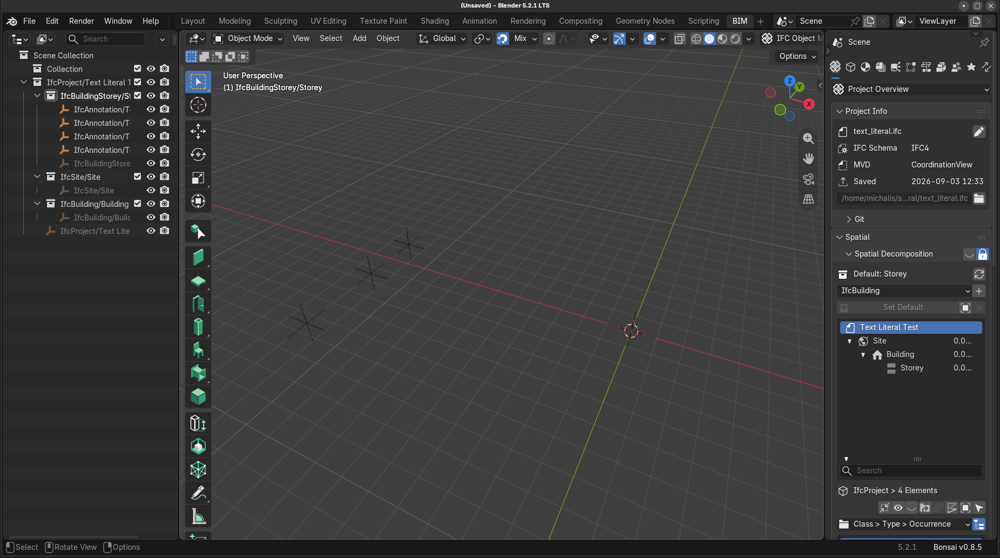
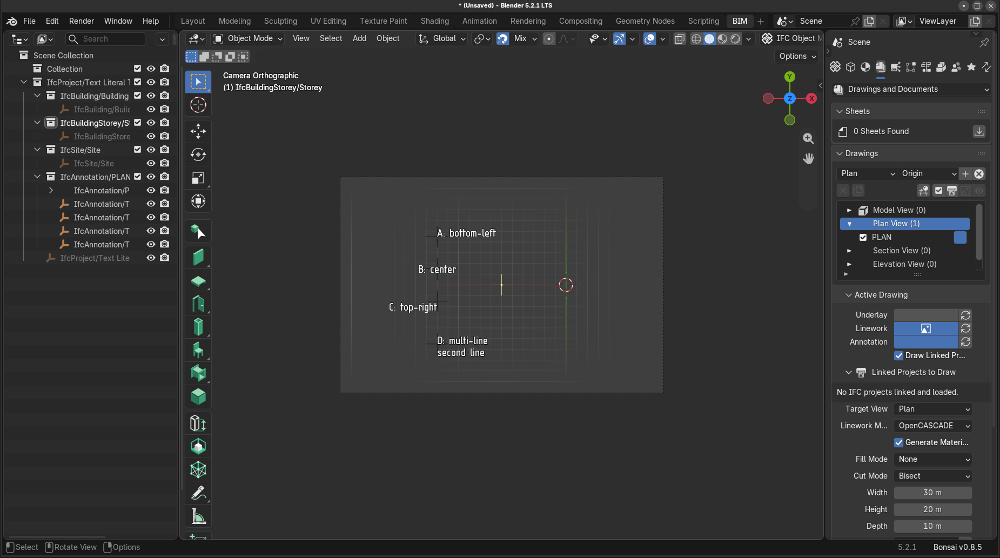

# Text in IFC using IfcTextLiteral (and IfcTextLiteralWithExtent)

Test text in IFC, using IFC entities:

- [IfcTextLiteral](https://standards.buildingsmart.org/IFC/RELEASE/IFC4_3/HTML/lexical/IfcTextLiteral.htm)
- [IfcTextLiteralWithExtent](https://standards.buildingsmart.org/IFC/RELEASE/IFC4_3/HTML/lexical/IfcTextLiteralWithExtent.htm)

This is the IFC counterpart of the X3D `Text` node. See [X3D Text component docs at Castle Game Engine](https://castle-engine.io/x3d_implementation_text.php) for links to X3D.

The model `text_literal.ifc` / `text_literal.ifcjson` (STEP / JSON encoding) contains 4 texts.

Each text is

- an `IfcAnnotation` (with `ObjectType = 'TEXT'`)

- ...whose representation (`IfcShapeRepresentation`, with `RepresentationIdentifier = 'Annotation'`, `RepresentationType = 'Annotation2D'`, in a subcontext with `ContextIdentifier = 'Annotation'`)

- ...contains the text item (`IfcTextLiteral` or `IfcTextLiteralWithExtent`).

The 4 texts deliberately differ:

- *A: literal placement* --- position is in the `IfcTextLiteral.Placement`, the containing `IfcAnnotation` is at zero.

- *B: object placement* --- position is in the `IfcAnnotation.ObjectPlacement`, the `IfcTextLiteral.Placement` is an identity placement.

- *C: with extent* --- uses `IfcTextLiteralWithExtent`, so it also has `IfcPlanarExtent` and `BoxAlignment`.

- *D: rotated* --- the `IfcTextLiteral.Placement` is rotated. It is also a multi-line text (the literal contains a newline).

The texts are large (a few meters) because we display them with the default X3D font size 1.0, which means 1 meter in this model (the model units are meters).

`text_literal.x3dv` is only a wrapper around IFC model, to add a good `Viewpoint` for the screenshot:


## Regenerating

`generate.py` creates `text_literal.ifc` using [IfcOpenShell](https://ifcopenshell.org/) (`pip install ifcopenshell`). We did it this way, as we wanted to test _IfcOpenShell_ BTW too (it is used underneath by BonsaiBIM).

JSON encoding in `text_literal.ifcjson` was made by [our fork of the ifcJSON Python scripts](https://github.com/michaliskambi/ifcJSON).

In total:

```
python3 generate.py
python3 ifcJSON/file_converters/ifc2json.py -i text_literal.ifc -o text_literal.ifcjson
```

`generate_visible_in_bonsai_bim.py` creates the BonsaiBIM variant in an analogous way.

Note that the generators make new GUIDs on every run.

## Visibility of IfcTextLiteral in other applications

Neither [BonsaiBIM](https://bonsaibim.org/) nor [FreeCAD](https://www.freecad.org/) display an `IfcTextLiteral` as 3D geometry out-of-the-box, like _Castle Game Engine_ does. Opening `text_literal.ifc` will not show any visible text.

### BonsaiBIM (Blender)

Opening `text_literal.ifc`: you will see 4 empties ("pivots") and no text.



Reason: That's how BonsaiBIM handles `IfcTextLiteral` elements.

- On import, an element whose only geometry is an `IfcTextLiteral` gets no mesh and becomes a plain Blender empty. See the comment in [bonsai/bim/import_ifc.py](https://github.com/IfcOpenShell/IfcOpenShell/blob/v0.9.0/src/bonsai/bonsai/bim/import_ifc.py): _"Skip elements without geometry - e.g. annotations with IfcTextLiterals."_

- Texts are instead drawn as a viewport overlay (a *decorator*), and only when *all* of these hold (see `object_decorators` in `bonsai/bim/module/drawing/data.py` and `bonsai/bim/module/drawing/decoration.py`):

    - decorations are enabled,

    - there is an *active drawing* --- an `IfcAnnotation` with `ObjectType = 'DRAWING'`, which BonsaiBIM loads as a Blender camera,

    - the text annotation belongs to *that* drawing's group,

    - the 3D viewport is in camera view.

- Another BonsaiBIM limitation: it reads `BoxAlignment` unconditionally, so it only copes with `IfcTextLiteralWithExtent`, never with a plain `IfcTextLiteral`. (TODO: link to line of code as a proof.)

The `text_literal.ifc` has no drawing, so nothing draws the texts. You can still confirm the text was read: select one of the empties and look at the *Text* panel in the BonsaiBIM properties, the literal is there.

`text_literal_visible_in_bonsai_bim.ifc` (and `.ifcjson`) contains the same kind of texts, restructured to satisfy all the BonsaiBIM conditions listed above. To see the texts: open the file in Blender, go to the *Drawings* panel, and activate (double-click) the `PLAN` drawing.



WARNING: Claude-generated description of `text_literal_visible_in_bonsai_bim.ifc` changes below, trust accordingly.

Compared to `text_literal.ifc`, it adds:

- an `IfcAnnotation` with `ObjectType = 'DRAWING'` (the camera), with a `Body`
  representation in the Model / `MODEL_VIEW` context holding an `IfcCsgSolid`
  of an `IfcBlock` --- that box is the camera volume,
- an `EPset_Drawing` property set on it. It must be complete: BonsaiBIM's
  *Activate Drawing* calls `bim.reload_drawing_styles`, which fails with
  *"Could not find shading styles path in EPset_Drawing.ShadingStyles"* if
  `ShadingStyles` is missing. So we write all 13 properties BonsaiBIM writes
  (`TargetView`, `Scale`, `HumanScale`, `HasUnderlay`, `HasLinework`,
  `HasAnnotation`, `GlobalReferencing`, `Stylesheet`, `Markers`, `Symbols`,
  `Patterns`, `ShadingStyles`, `CurrentShadingStyle`). The resource paths are
  relative to the IFC file and need not exist --- BonsaiBIM copies its own
  defaults there, so activating the drawing creates a `drawings/assets/`
  subdirectory next to this file,
- an `IfcGroup` with `ObjectType = 'DRAWING'` that groups the drawing together
  with all the texts (this is the link BonsaiBIM follows), and its parent
  `IfcGroup` with `ObjectType = 'DRAWINGS'`,
- an `IfcDocumentInformation` (with `Scope = 'DRAWING'`) associated with the
  drawing, like BonsaiBIM does,
- an `EPset_Annotation` property set on each text with `Classes = 'title'` ---
  this is how BonsaiBIM expresses the font size (`small`, `regular`, `large`,
  `header`, `title` = 1.8, 2.5, 3.5, 5, 7 mm on the paper).

and changes:

- all texts are `IfcTextLiteralWithExtent` (BonsaiBIM cannot cope with a plain
  `IfcTextLiteral`, see above),
- all texts are positioned by `IfcAnnotation.ObjectPlacement`, since BonsaiBIM
  draws the text at the object origin and ignores the literal's placement,
- the texts differ by `BoxAlignment` instead of by placement style.

The drawing itself is deliberately *not* placed in the spatial structure ---
just like BonsaiBIM does it --- which also keeps its camera volume out of
viewers that display the whole spatial structure, like _Castle Game Engine_.

### FreeCAD

WARNING: Claude-generated description below, trust accordingly. TODO: I could not find a way how to raise its `FontSize` (to e.g. 1000) to actually see it.

FreeCAD *does* create a `Draft Text` object for every literal
(`get2DShape` in `importers/importIFCHelper.py`, TODO: link to line of code), but they are easy to miss:

- They are created as a side effect, and the importer then returns nothing, so
  they end up in no container --- look for them at the top of the model tree.

- Their size comes from the Draft `textheight` preference, a few millimeters,
  while the model is imported in millimeters and is 26000 mm wide. So the text
  is there, but roughly a thousand times too small to see. Select a text object
  and raise its `FontSize` (to e.g. 1000) to actually see it.

- FreeCAD reads only the `IfcTextLiteral.Placement` and ignores the placement of
  the containing `IfcAnnotation` --- the opposite of what FreeCAD itself writes
  on export. So only text *A* lands where it should, and *B*, *C*, *D* end up
  stacked at the origin.

- FreeCAD treats `;` inside the literal as a line separator
  (we don't --- we honor only real newlines).
