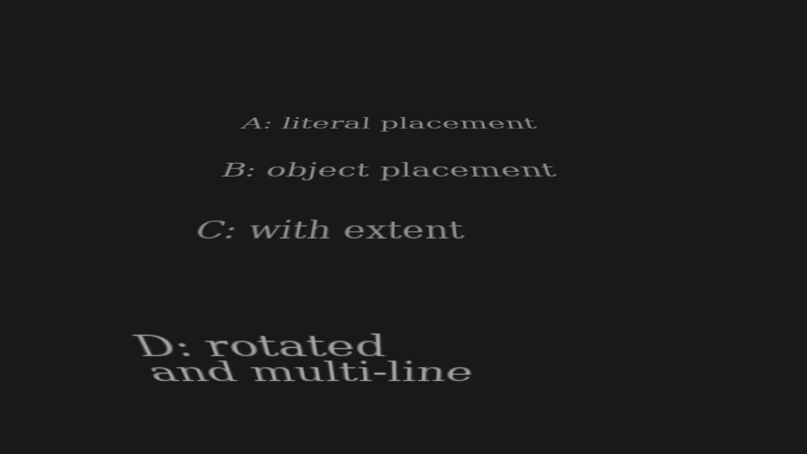
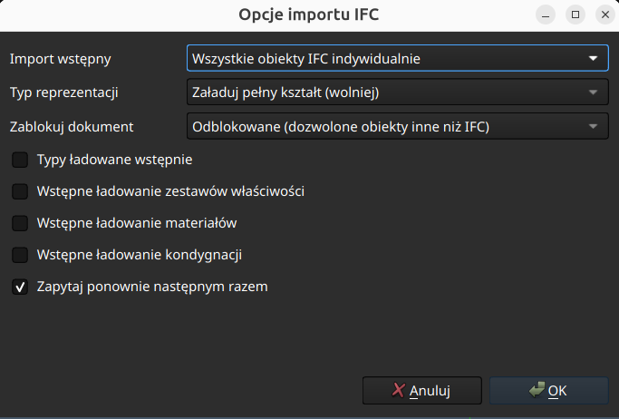
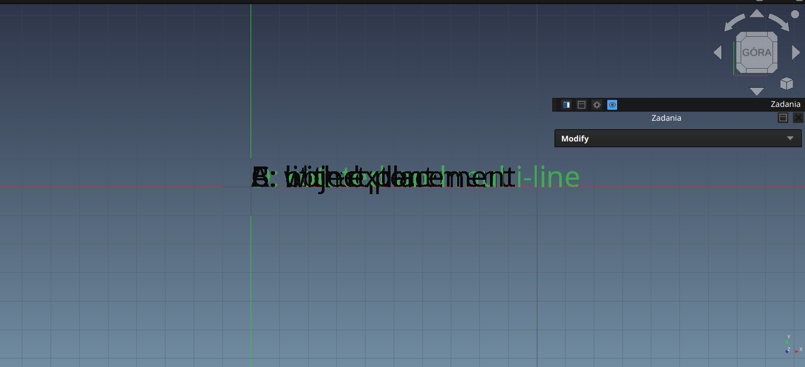

# Text in IFC using IfcTextLiteral (and IfcTextLiteralWithExtent)

Test text in IFC, using IFC entities:

- [IfcTextLiteral](https://standards.buildingsmart.org/IFC/RELEASE/IFC4_3/HTML/lexical/IfcTextLiteral.htm)
- [IfcTextLiteralWithExtent](https://standards.buildingsmart.org/IFC/RELEASE/IFC4_3/HTML/lexical/IfcTextLiteralWithExtent.htm)

This is the IFC counterpart of the X3D `Text` node. See [X3D Text component docs at Castle Game Engine](https://castle-engine.io/x3d_implementation_text.php) for links to X3D.

The model `text_literal.ifc` / `text_literal.ifcjson` (STEP / JSON encoding) contains 4 texts.

Each text is

- an `IfcAnnotation` (with `ObjectType = 'TEXT'`)

- ...whose representation (`IfcShapeRepresentation`, with `RepresentationIdentifier = 'Annotation'`, `RepresentationType = 'Annotation2D'`, in a subcontext with `ContextIdentifier = 'Annotation'`)

- ...contains the text item (`IfcTextLiteral` or `IfcTextLiteralWithExtent`).

The 4 texts deliberately differ:

- *A: literal placement* --- position is in the `IfcTextLiteral.Placement`, the containing `IfcAnnotation` is at zero.

- *B: object placement* --- position is in the `IfcAnnotation.ObjectPlacement`, the `IfcTextLiteral.Placement` is an identity placement.

- *C: with extent* --- uses `IfcTextLiteralWithExtent`, so it also has `IfcPlanarExtent` and `BoxAlignment`.

- *D: rotated* --- the `IfcTextLiteral.Placement` is rotated. It is also a multi-line text (the literal contains a newline).

The texts are large (a few meters) because we display them with the default X3D font size 1.0, which means 1 meter in this model (the model units are meters).

`text_literal.x3dv` is only a wrapper around IFC model, to add a good `Viewpoint` for the screenshot:



## Regenerating

`text_literal_generate.py` creates `text_literal.ifc` using [IfcOpenShell](https://ifcopenshell.org/) (`pip install ifcopenshell`). We did it this way, as we wanted to test _IfcOpenShell_ BTW too (it is used underneath by BonsaiBIM).

JSON encoding in `text_literal.ifcjson` was made by [our fork of the ifcJSON Python scripts](https://github.com/michaliskambi/ifcJSON).

In total:

```
python3 text_literal_generate.py
python3 ifcJSON/file_converters/ifc2json.py -i text_literal.ifc -o text_literal.ifcjson
```

`text_literal_visible_in_bonsai_bim_generate.py` creates the variant `text_literal_visible_in_bonsai_bim.ifc`, with annotations actually visible in Blender, in an analogous way.

Note that the generators make new GUIDs on every run.

## Visibility of IfcTextLiteral in other applications

Neither [BonsaiBIM](https://bonsaibim.org/) nor [FreeCAD](https://www.freecad.org/) display an `IfcTextLiteral` as 3D geometry out-of-the-box, like _Castle Game Engine_ does. Opening `text_literal.ifc` will not show any visible text.

### BonsaiBIM (Blender)

Opening `text_literal.ifc`: you will see 4 empties ("pivots") and no text.


Reason: That's how BonsaiBIM handles `IfcTextLiteral` elements.

TODO: Confirm all claims below with exact links to BonsaiBIM source code.

- On import, an element whose only geometry is an `IfcTextLiteral` gets no mesh and becomes a plain Blender empty. See the comment in [bonsai/bim/import_ifc.py](https://github.com/IfcOpenShell/IfcOpenShell/blob/v0.9.0/src/bonsai/bonsai/bim/import_ifc.py): _"Skip elements without geometry - e.g. annotations with IfcTextLiterals."_

- Texts are instead drawn as a viewport overlay (a *decorator*), and only when *all* of these hold (see `object_decorators` in `bonsai/bim/module/drawing/data.py` and `bonsai/bim/module/drawing/decoration.py`):

    - decorations are enabled,

    - there is an *active drawing* --- an `IfcAnnotation` with `ObjectType = 'DRAWING'`, which BonsaiBIM loads as a Blender camera,

    - the text annotation belongs to *that* drawing's group,

    - the 3D viewport is in camera view.

- Another BonsaiBIM limitation: it reads `BoxAlignment` unconditionally, so it only copes with `IfcTextLiteralWithExtent`, never with a plain `IfcTextLiteral`. (TODO: link to line of code as a proof.)

The `text_literal.ifc` has no drawing, so nothing draws the texts. You can still confirm the text was read: select one of the empties and look at the *Text* panel in the BonsaiBIM properties, the literal is there.

`text_literal_visible_in_bonsai_bim.ifc` (and `.ifcjson`) contains the same kind of texts, restructured to satisfy all the BonsaiBIM conditions listed above. To see the texts: open the file in Blender, go to the *Drawings* panel, and activate (double-click) the `PLAN` drawing.


### FreeCAD

Seems it doesn't load the texts as visible objects in the 3D view. I could only get them to load by choosing "Load each IFC object invidually" in the import options, and then they only overlap with each other.





TODO: Research below is mixed with Claude claims, trust it (not) accordingly (initial versions of this research had indeed mistakes). TODO: Confirm all claims below with links to FreeCAD source code:

- FreeCAD *does* create a `Draft Text` object for every literal...

- ...but they are created as a side effect, and the importer then returns nothing, so
  they end up in no container. (This matches the behavior observed.)

- Also note: FreeCAD reads only the `IfcTextLiteral.Placement` and ignores the placement of
  the containing `IfcAnnotation` --- the opposite of what FreeCAD itself writes
  on export. So only text *A* lands where it should, and *B*, *C*, *D* end up
  stacked at the origin.

- Also note: FreeCAD treats `;` inside the literal as a line separator
  (we don't --- we honor only real newlines).
